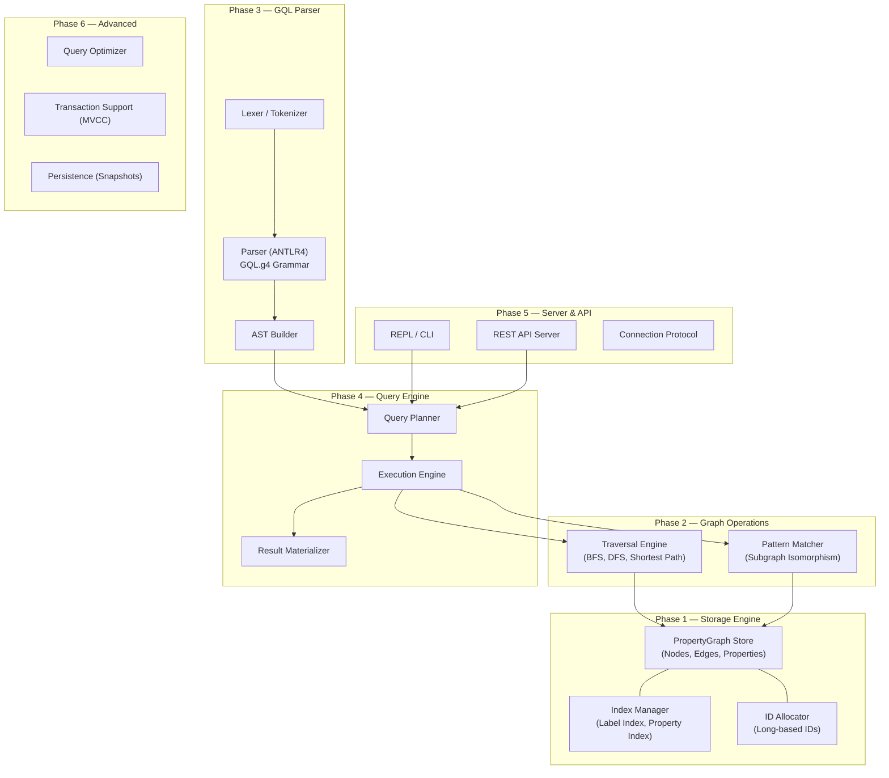

# BlazeGraph — In-Memory Graph Database with GQL Support

An in-memory property graph database capable of handling **100K nodes and relationships**, with a **GQL (ISO/IEC 39075) query interpreter**. Built in a phased approach from storage engine to full query execution.

---

## User Review Required

> [!IMPORTANT]
> **Language Choice**: This plan needs your decision on the implementation language. Below is a trade-off summary:
>
> | Criteria | Java | Rust | C++ |
> |---|---|---|---|
> | **Performance** | Good (JIT, but GC pauses) | Excellent (zero-cost abstractions, no GC) | Excellent (manual control, SIMD) |
> | **Memory Safety** | GC-managed | Compile-time guaranteed | Manual (footgun risk) |
> | **Parser Tooling** | ANTLR4 (best-in-class) | `pest` / `nom` / LALRPOP | ANTLR4 C++ target / Flex+Bison |
> | **Ecosystem for DBs** | Mature (Neo4j, JanusGraph) | Growing (SurrealDB, Indradb) | Mature (Memgraph, DGraph internals) |
> | **Dev Velocity** | Fast (rich libs, IDE support) | Medium (steep learning curve, borrow checker) | Medium (manual memory mgmt) |
> | **100K Scale Fit** | ✅ Excellent — JVM overhead negligible at this scale | ✅ Excellent | ✅ Excellent |
>
> **Recommendation**: **Java** is the strongest choice for this project because:
> 1. At 100K scale, JVM overhead is negligible — you won't hit GC issues.
> 2. ANTLR4 has first-class Java support, and community GQL grammars target ANTLR4.
> 3. Fastest time-to-working-product with excellent tooling.
> 4. The project name "BlazeGraph" aligns with Java DB tradition (Neo4j, JanusGraph).

> [!IMPORTANT]
> **GQL Scope**: The full ISO GQL spec is enormous. This plan targets a **practical subset** covering the most valuable operations. Please review the GQL subset in Phase 3 and confirm what you need.

---

## Open Questions

1. **Persistence**: Should there be an optional disk-persistence layer (snapshot/WAL) for durability, or is pure in-memory sufficient?
2. **Concurrency**: Do you need multi-threaded concurrent read/write access, or is single-threaded (with optional read parallelism) acceptable?
3. **API Surface**: Beyond the GQL interpreter, do you want a REST/gRPC server, or is an embedded library API sufficient for now?
4. **Visualization**: Do you want a web-based graph visualization UI in a later phase?

---

## Architecture Overview



---

## Phase 1 — Core Storage Engine

**Goal**: Build the foundational in-memory property graph data model optimized for 100K nodes/edges.

### Data Model Design

The storage uses **index-free adjacency** (direct references between nodes and edges) for O(1) neighbor traversal:

```
Node {
    id: long
    labels: Set<String>
    properties: Map<String, Object>
    outEdges: List<Edge>       // direct references
    inEdges: List<Edge>        // direct references
}

Edge {
    id: long
    type: String
    properties: Map<String, Object>
    sourceNode: Node           // direct reference
    targetNode: Node           // direct reference
}

PropertyGraph {
    nodes: Map<Long, Node>     // ID → Node lookup
    edges: Map<Long, Edge>     // ID → Edge lookup
    labelIndex: Map<String, Set<Long>>      // label → node IDs
    typeIndex: Map<String, Set<Long>>       // edge type → edge IDs
    propertyIndex: Map<String, Map<Object, Set<Long>>>  // property key → value → element IDs
}
```

### Memory Budget (100K scale)

| Component | Per Element | At 100K |
|---|---|---|
| Node (avg 2 labels, 5 props, 10 edges) | ~500 bytes | ~50 MB |
| Edge (1 type, 3 props) | ~300 bytes | ~30 MB |
| Indexes | — | ~20 MB |
| **Total estimated** | — | **~100 MB** |

Well within single-JVM heap capacity (default 256 MB+).

### Components

#### [NEW] `core/model/Node.java`
- Immutable ID, mutable labels/properties/edge lists
- `addLabel()`, `removeLabel()`, `setProperty()`, `getProperty()`

#### [NEW] `core/model/Edge.java`
- Immutable ID, source, target; mutable type/properties

#### [NEW] `core/model/PropertyValue.java`
- Type-safe wrapper supporting: `STRING`, `INTEGER`, `DOUBLE`, `BOOLEAN`, `LIST`, `MAP`

#### [NEW] `core/storage/PropertyGraphStore.java`
- Central store: `createNode()`, `createEdge()`, `deleteNode()`, `deleteEdge()`
- `getNode(id)`, `getEdge(id)`, `getNodesByLabel()`, `getEdgesByType()`
- ID allocation (atomic `AtomicLong` counter)

#### [NEW] `core/index/LabelIndex.java`
- Inverted index: `label → Set<nodeId>`
- Updated automatically on node create/delete/label change

#### [NEW] `core/index/PropertyIndex.java`
- Inverted index: `propertyKey → value → Set<elementId>`
- Supports equality lookups; range queries in later phase

---

## Phase 2 — Graph Traversal & Pattern Matching

**Goal**: Implement core graph algorithms needed by the query engine.

#### [NEW] `core/traversal/TraversalEngine.java`
- **BFS** / **DFS** with configurable:
  - Direction: `OUTGOING`, `INCOMING`, `BOTH`
  - Max depth
  - Edge type filter
  - Node label filter
- Returns `Path` objects (ordered list of alternating nodes/edges)

#### [NEW] `core/traversal/PathFinder.java`
- **Shortest path** (unweighted BFS)
- **All shortest paths**
- **Variable-length path matching** (for GQL quantified path patterns)

#### [NEW] `core/pattern/PatternMatcher.java`
- Subgraph pattern matching engine
- Takes a `GraphPattern` (from the AST) and finds all matching subgraphs
- Uses **backtracking search** with pruning via label/type indexes
- Produces `BindingTable` (variable → value mappings per match)

#### [NEW] `core/pattern/GraphPattern.java`
- Internal representation of a graph pattern:
  - `PatternNode` (variable name, label constraints, property predicates)
  - `PatternEdge` (variable name, type constraint, direction, quantifier)

---

## Phase 3 — GQL Parser (ANTLR4)

**Goal**: Parse a practical subset of ISO GQL into an Abstract Syntax Tree.

### GQL Subset Supported

> [!NOTE]
> This targets the **most valuable 80%** of GQL. Advanced features (graph types, catalog operations, session management) are deferred.

| Category | Supported Statements/Clauses |
|---|---|
| **Data Query** | `MATCH`, `OPTIONAL MATCH`, `RETURN`, `WHERE`, `ORDER BY`, `LIMIT`, `SKIP` |
| **Pattern Syntax** | Node patterns `(n:Label)`, edge patterns `-[e:TYPE]->`, undirected `~[e]~`, variable-length `*1..5` |
| **Expressions** | Property access `n.name`, literals, arithmetic, comparison, `AND`/`OR`/`NOT`, `IN`, `IS NULL` |
| **Aggregation** | `COUNT()`, `SUM()`, `AVG()`, `MIN()`, `MAX()`, `COLLECT()` |
| **Data Mutation** | `INSERT` (nodes/edges), `SET` (properties/labels), `DELETE`, `DETACH DELETE` |
| **Composition** | `NEXT` (linear composition of statements) |
| **Set Operations** | `UNION`, `UNION ALL` |

### Components

#### [NEW] `parser/GQL.g4`
- Combined ANTLR4 grammar (lexer + parser rules in single file)
- Based on ISO 39075 BNF, adapted for ANTLR4 (resolve left-recursion, add alternative labels)
- Key parser rules: `gqlProgram`, `statement`, `matchStatement`, `returnClause`, `patternExpression`, `insertStatement`

#### [NEW] `parser/GQLAstBuilder.java`
- ANTLR4 Visitor implementation
- Walks parse tree → produces typed AST nodes

#### [NEW] `parser/ast/*.java` (AST node classes)
- `Statement`, `MatchStatement`, `ReturnStatement`, `InsertStatement`, `DeleteStatement`
- `PatternExpression`, `NodePattern`, `EdgePattern`
- `Expression`, `PropertyAccess`, `Literal`, `BinaryOp`, `FunctionCall`
- `OrderByClause`, `LimitClause`, `WhereClause`

---

## Phase 4 — Query Execution Engine

**Goal**: Execute parsed GQL ASTs against the storage engine and return results.

#### [NEW] `engine/QueryEngine.java`
- Entry point: `execute(String gql) → QueryResult`
- Pipeline: `Parse → Plan → Execute → Materialize`

#### [NEW] `engine/planner/QueryPlanner.java`
- Converts AST into a **logical execution plan** (tree of operators)
- Operator types:
  - `ScanOp` — full label scan or index lookup
  - `ExpandOp` — traverse edges from bound nodes
  - `FilterOp` — apply WHERE predicates
  - `ProjectOp` — RETURN column selection
  - `AggregateOp` — GROUP BY + aggregation functions
  - `SortOp` — ORDER BY
  - `LimitOp` — LIMIT/SKIP
  - `MutateOp` — INSERT/SET/DELETE side effects

#### [NEW] `engine/executor/PlanExecutor.java`
- **Volcano/iterator model**: each operator implements `open()`, `next()`, `close()`
- Operators pull rows lazily from child operators
- Produces `BindingTable` (list of `Map<String, Object>` rows)

#### [NEW] `engine/result/QueryResult.java`
- Columns, rows, metadata (execution time, nodes/edges affected)
- Pretty-print formatting for REPL output

---

## Phase 5 — REPL, CLI & Server

**Goal**: Provide user-facing interfaces to interact with BlazeGraph.

#### [NEW] `server/BlazeGraphRepl.java`
- Interactive REPL with:
  - Multi-line query input (semicolon-terminated)
  - Syntax highlighting hints
  - Query timing output
  - `:help`, `:schema`, `:stats`, `:clear` meta-commands

#### [NEW] `server/BlazeGraphServer.java`
- Lightweight HTTP server (using `com.sun.net.httpserver` or Javalin)
- Endpoints:
  - `POST /query` — execute GQL, return JSON results
  - `GET /schema` — return graph schema (labels, types, property keys)
  - `GET /stats` — node/edge counts, memory usage

#### [NEW] `cli/BlazeGraphCli.java`
- Command-line interface: `blazegraph --query "MATCH (n:Person) RETURN n"`
- File input: `blazegraph --file queries.gql`
- Batch import: `blazegraph --import data.csv --format nodes|edges`

---

## Phase 6 — Advanced Features (Future)

| Feature | Description |
|---|---|
| **Query Optimizer** | Cost-based optimization: join ordering, index selection, predicate pushdown |
| **Transactions (MVCC)** | Multi-version concurrency control for concurrent reads/writes |
| **Snapshots** | Periodic serialization to disk for recovery |
| **Schema Constraints** | Unique constraints, existence constraints, node key constraints |
| **Full-text Search** | Property value full-text indexing (Lucene integration) |
| **Graph Algorithms** | PageRank, community detection, connected components |
| **Web Visualization** | D3.js/Cytoscape.js-based graph explorer UI |

---

## Verification Plan

### Automated Tests
Each phase includes comprehensive unit + integration tests:

```bash
# Phase 1: Storage correctness
mvn test -pl core -Dtest="*StorageTest,*IndexTest"

# Phase 2: Traversal correctness
mvn test -pl core -Dtest="*TraversalTest,*PatternMatchTest"

# Phase 3: Parser correctness
mvn test -pl parser -Dtest="*ParserTest,*AstBuilderTest"

# Phase 4: End-to-end query tests
mvn test -pl engine -Dtest="*QueryEngineTest"

# Phase 5: Server integration tests
mvn test -pl server -Dtest="*ServerTest"

# All tests
mvn test
```

### Performance Benchmarks
```bash
# Benchmarks targeting 100K scale
mvn exec:java -pl benchmark -Dexec.mainClass="blazegraph.benchmark.ScaleBenchmark"
```

**Targets** (on modern hardware):
| Operation | Target |
|---|---|
| Node creation (100K) | < 500 ms |
| Edge creation (100K) | < 1 sec |
| Single-hop traversal | < 1 ms |
| 3-hop pattern match (100K graph) | < 100 ms |
| GQL parse + execute (simple MATCH) | < 10 ms |

### Manual Verification
- Load a realistic dataset (e.g., movie database) with ~50K nodes and ~100K relationships
- Run a suite of GQL queries covering all supported features
- Verify result correctness against expected outputs

---

## Project Structure

```
BlazeGraph/
├── pom.xml                          # Maven multi-module parent
├── core/                            # Phase 1 + 2
│   ├── pom.xml
│   └── src/
│       ├── main/java/blazegraph/core/
│       │   ├── model/               # Node, Edge, PropertyValue
│       │   ├── storage/             # PropertyGraphStore
│       │   ├── index/               # LabelIndex, PropertyIndex
│       │   ├── traversal/           # TraversalEngine, PathFinder
│       │   └── pattern/             # PatternMatcher, GraphPattern
│       └── test/java/blazegraph/core/
├── parser/                          # Phase 3
│   ├── pom.xml
│   └── src/
│       ├── main/
│       │   ├── antlr4/              # GQL.g4
│       │   └── java/blazegraph/parser/
│       │       ├── ast/             # AST node classes
│       │       └── GQLAstBuilder.java
│       └── test/java/blazegraph/parser/
├── engine/                          # Phase 4
│   ├── pom.xml
│   └── src/
│       ├── main/java/blazegraph/engine/
│       │   ├── planner/             # QueryPlanner
│       │   ├── executor/            # PlanExecutor, operators
│       │   └── result/              # QueryResult
│       └── test/java/blazegraph/engine/
├── server/                          # Phase 5
│   ├── pom.xml
│   └── src/
│       └── main/java/blazegraph/server/
├── cli/                             # Phase 5
│   └── ...
└── benchmark/                       # Performance tests
    └── ...
```

---

## Estimated Timeline

| Phase | Scope | Estimated Effort |
|---|---|---|
| **Phase 1** | Core Storage Engine | 3–4 days |
| **Phase 2** | Traversal & Pattern Matching | 2–3 days |
| **Phase 3** | GQL Parser (ANTLR4) | 4–5 days |
| **Phase 4** | Query Execution Engine | 4–5 days |
| **Phase 5** | REPL, CLI & Server | 2–3 days |
| **Phase 6** | Advanced Features | Ongoing |
| **Total (Phases 1–5)** | | **~15–20 days** |
