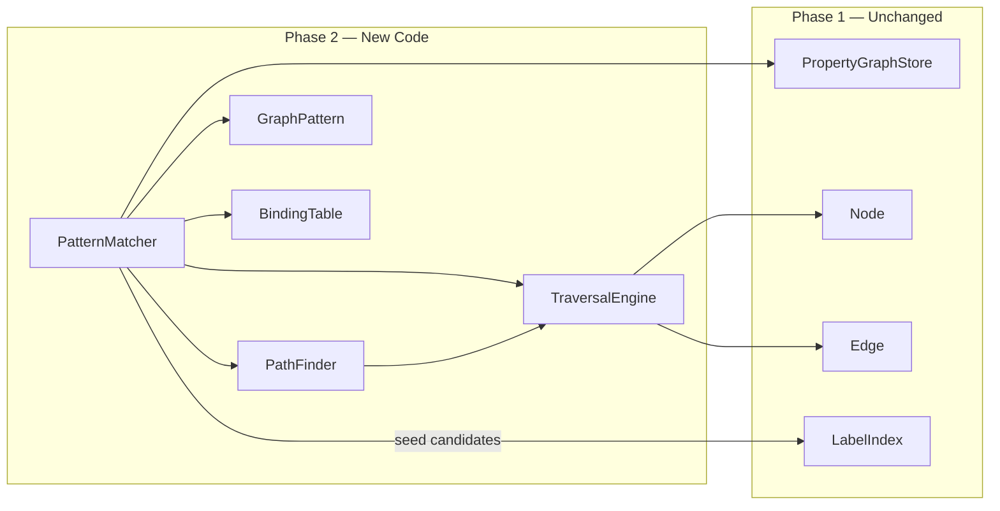

# Phase 2: Graph Traversal & Pattern Matching

**Goal:** Build the traversal and pattern-matching engine on top of the Phase 1 storage layer. This phase provides the algorithmic backbone that the GQL query engine (Phase 4) will call into when executing `MATCH` clauses and path expressions.

---

## Prerequisites from Phase 1

Phase 2 depends directly on these Phase 1 APIs:

| Phase 1 Component | Usage in Phase 2 |
|---|---|
| `Node.getOutEdges()` / `Node.getInEdges()` | Index-free adjacency traversal — O(1) neighbor access |
| `Edge.getType()` / `Edge.getSource()` / `Edge.getTarget()` | Direction-aware edge expansion |
| `Node.getLabels()` / `Node.getProperties()` | Filter predicates during traversal |
| `PropertyGraphStore.getNodesByLabel()` | Seed node selection for pattern matching |
| `PropertyGraphStore.getNode(id)` | Node resolution from index results |

---

## 1. Direction Enum

A simple enum to control traversal direction, used across all traversal and pattern-matching APIs.

### [NEW] `core/traversal/Direction.java`
```java
public enum Direction {
    OUTGOING,   // follow outEdges only
    INCOMING,   // follow inEdges only
    BOTH        // follow both directions (treat graph as undirected)
}
```

---

## 2. Path Representation

A `Path` captures an ordered walk through the graph — an alternating sequence of nodes and edges. It is the return type for traversals and path-finding operations.

### [NEW] `core/traversal/Path.java`
- **Fields:**
  - `nodes: List<Node>` — ordered list of visited nodes
  - `edges: List<Edge>` — ordered list of traversed edges (`edges.size() == nodes.size() - 1`)
- **Methods:**
  - `startNode()` / `endNode()` — first and last node
  - `length()` — number of edges (hops)
  - `contains(Node)` — cycle detection helper
  - `append(Edge, Node)` → returns a new `Path` with the hop added (immutable builder pattern)
- **Design:** Paths are **immutable** — each `append()` returns a new Path. This avoids mutation bugs during concurrent or recursive exploration and aligns with functional backtracking in the pattern matcher.

---

## 3. Traversal Engine

The core graph-walking component. Implements configurable BFS and DFS with filtering, used both directly and by higher-level components (PathFinder, PatternMatcher).

### [NEW] `core/traversal/TraversalEngine.java`

#### Configuration (Builder pattern)
```
TraversalEngine.from(store, startNode)
    .direction(Direction.OUTGOING)
    .maxDepth(3)
    .edgeTypeFilter("KNOWS", "FRIEND_OF")   // only follow these edge types
    .nodeLabelFilter("Person")               // only visit nodes with this label
    .uniqueNodes(true)                       // never revisit a node (cycle avoidance)
    .build()
```

#### BFS Traversal — `bfs() → List<Path>`
- Standard BFS using a `Queue<Path>`.
- At each step, expand the frontier by following edges matching the direction and type filters.
- Skip nodes that fail the label filter.
- If `uniqueNodes` is set, maintain a `Set<Long>` of visited node IDs.
- Stop expanding a path when it reaches `maxDepth`.
- Returns all paths from the start node to every reachable node (within constraints).

#### DFS Traversal — `dfs() → List<Path>`
- Recursive or stack-based DFS.
- Same filtering and depth-limiting logic as BFS.
- Returns paths in depth-first discovery order.

#### Stream-style Visitor — `traverse(TraversalVisitor) → void`
```java
public interface TraversalVisitor {
    /** Called when a node is first discovered. Return false to prune this branch. */
    boolean onNodeVisited(Node node, Path pathToNode);

    /** Called when an edge is about to be followed. Return false to skip it. */
    boolean onEdgeTraversed(Edge edge, Path currentPath);
}
```
This callback API allows callers (like the pattern matcher) to implement custom expansion logic without materializing all paths into memory.

---

## 4. Path Finder

Higher-level path-finding algorithms built on top of the traversal engine.

### [NEW] `core/traversal/PathFinder.java`

#### `shortestPath(Node source, Node target, Direction dir) → Optional<Path>`
- Unweighted shortest path via BFS.
- Terminates immediately when `target` is first reached (BFS guarantees shortest).
- Respects direction, edge type filters, max depth.

#### `allShortestPaths(Node source, Node target, Direction dir) → List<Path>`
- BFS-based, but continues exploring the frontier at the depth where `target` was first found.
- Collects all paths of that minimum length.

#### `variableLengthPaths(Node source, Direction dir, int minHops, int maxHops) → List<Path>`
- Returns all paths from `source` with length in `[minHops, maxHops]`.
- Critical for GQL quantified path patterns like `-[:KNOWS*1..5]->`.
- Uses iterative deepening: start a BFS, collect paths whose length falls within the bounds.

---

## 5. Pattern Matching Engine

The most critical component — this is what executes GQL `MATCH` clauses. Given a declarative graph pattern, it finds all subgraphs in the store that satisfy it.

### Pattern Representation

#### [NEW] `core/pattern/PatternNode.java`
- **Fields:**
  - `variableName: String` — the binding variable (e.g., `n` in `(n:Person)`)
  - `labelConstraints: Set<String>` — required labels (all must match)
  - `propertyPredicates: Map<String, PropertyValue>` — exact-match property filters
- **Example:** `(n:Person {name: "Alice"})` → `PatternNode("n", {"Person"}, {"name": "Alice"})`

#### [NEW] `core/pattern/PatternEdge.java`
- **Fields:**
  - `variableName: String` — binding variable (e.g., `r` in `-[r:KNOWS]->`)
  - `typeConstraint: String` — required edge type (nullable = any type)
  - `direction: Direction` — `OUTGOING`, `INCOMING`, or `BOTH`
  - `minHops: int` / `maxHops: int` — quantifier bounds (default 1..1 for fixed-length)
  - `sourcePatternNode: PatternNode` — pattern node on the left side
  - `targetPatternNode: PatternNode` — pattern node on the right side

#### [NEW] `core/pattern/GraphPattern.java`
- **Fields:**
  - `patternNodes: List<PatternNode>`
  - `patternEdges: List<PatternEdge>`
- **Purpose:** Represents an entire `MATCH` clause pattern. A connected graph of pattern nodes linked by pattern edges.
- **Methods:**
  - `getBindingVariables()` — all variable names used
  - `getPatternNodesForLabel(label)` — index into the pattern

### Binding Table

#### [NEW] `core/pattern/BindingTable.java`
- A list of `Map<String, Object>` rows, where each row is one successful match.
- Keys are variable names (e.g., `"n"`, `"r"`, `"m"`).
- Values are `Node` or `Edge` objects.
- **Methods:**
  - `addRow(Map<String, Object>)` — append a new binding
  - `getRows()` → `List<Map<String, Object>>`
  - `project(List<String> variables)` — return a new BindingTable with only the specified columns
  - `join(BindingTable other)` — natural join on shared variable names (for multi-MATCH composition)

### Pattern Matcher

#### [NEW] `core/pattern/PatternMatcher.java`

The matching algorithm uses **backtracking search with index-driven candidate selection**:

```
match(GraphPattern pattern, PropertyGraphStore store) → BindingTable

Algorithm:
1. ORDER pattern nodes by selectivity heuristic:
   - Nodes with property predicates first (most selective → smallest candidate set)
   - Nodes with specific labels next
   - Unbound nodes last
   
2. For the first pattern node:
   - Use LabelIndex to get candidate node IDs
   - Filter candidates by property predicates
   
3. For each candidate binding of node[0]:
   - Find all pattern edges connected to node[0]
   - Expand via index-free adjacency (Node.getOutEdges/getInEdges)
   - Filter edges by type constraint
   - Check if the neighbor satisfies the next pattern node's constraints
   - For variable-length edges: use PathFinder.variableLengthPaths()
   - Recursively bind the next unbound pattern node
   
4. When all pattern nodes are bound → emit a row to the BindingTable

5. Backtrack and try next candidate
```

**Pruning optimizations:**
- **Index-driven seeding:** Always start from the most selective pattern node (smallest candidate set from the index).
- **Early termination:** If a pattern node has no candidates, immediately return empty.
- **Visited-set:** Skip already-bound nodes to avoid duplicate bindings (unless the pattern explicitly re-uses a variable, indicating a cycle query).

---

## 6. Integration with PropertyGraphStore

Phase 2 does **not** modify any Phase 1 classes. All new code lives in the `core/traversal/` and `core/pattern/` packages and calls the existing `PropertyGraphStore`, `Node`, and `Edge` public APIs.



---

## 7. File Inventory

All files live under `core/src/main/java/blazegraph/core/`:

| File | Package | Purpose |
|---|---|---|
| `traversal/Direction.java` | traversal | Direction enum |
| `traversal/Path.java` | traversal | Immutable path representation |
| `traversal/TraversalVisitor.java` | traversal | Callback interface for custom traversal |
| `traversal/TraversalEngine.java` | traversal | Configurable BFS/DFS engine |
| `traversal/PathFinder.java` | traversal | Shortest-path & variable-length path algorithms |
| `pattern/PatternNode.java` | pattern | Node pattern descriptor |
| `pattern/PatternEdge.java` | pattern | Edge pattern descriptor |
| `pattern/GraphPattern.java` | pattern | Full graph pattern container |
| `pattern/BindingTable.java` | pattern | Result table of variable bindings |
| `pattern/PatternMatcher.java` | pattern | Backtracking subgraph matcher |

Test files under `core/src/test/java/blazegraph/core/`:

| File | Covers |
|---|---|
| `traversal/TraversalEngineTest.java` | BFS/DFS with filters on a small test graph |
| `traversal/PathFinderTest.java` | Shortest path, all shortest paths, variable-length |
| `pattern/PatternMatcherTest.java` | Single-hop, multi-hop, property-filtered patterns |

---

## 8. Verification Plan

### Unit Tests

**TraversalEngineTest** — Build a small graph (10–20 nodes):
- BFS returns correct level-order paths
- DFS returns correct depth-first paths
- Direction filtering works (OUTGOING only, INCOMING only, BOTH)
- Edge type filtering excludes non-matching edges
- Node label filtering skips non-matching nodes
- Max depth correctly limits traversal
- Cycle avoidance (uniqueNodes=true) prevents infinite loops on cyclic graphs

**PathFinderTest** — Diamond and linear graphs:
- `shortestPath` finds the minimum-hop path
- `allShortestPaths` returns all ties
- `variableLengthPaths(min=2, max=4)` returns only paths within the hop range
- Returns empty when no path exists

**PatternMatcherTest** — Movie-style test graph:
- Single node pattern: `(n:Person)` returns all Person nodes
- Single edge pattern: `(a:Person)-[:ACTED_IN]->(m:Movie)` returns correct pairs
- Property filter: `(a:Person {name: "Tom Hanks"})-[:ACTED_IN]->(m:Movie)` narrows results
- Multi-hop: `(a:Person)-[:KNOWS]->(b:Person)-[:KNOWS]->(c:Person)` finds 2-hop chains
- Variable-length: `(a)-[:KNOWS*1..3]->(b)` finds paths of varying lengths
- No-match: pattern with non-existent label returns empty BindingTable

### Performance Benchmark
- Run the pattern matcher on a 100K-node graph (created by the Phase 1 benchmark setup).
- Measure latency for:
  - Single-hop pattern match: target < 10 ms
  - 3-hop pattern match: target < 100 ms
  - Shortest path (100K graph, diameter ~10): target < 50 ms

---

## 9. Amendments (plan review, 2026-07-14)

Gaps found while reviewing this plan against Phase 1 code and Phase 3/4 needs — treat these as part of the Phase 2 scope:

1. **Anonymous pattern elements.** `(a)-[:KNOWS]->()` has no variable on the second node, and `-[:KNOWS]->` none on the edge. `variableName` must be nullable; the matcher auto-generates internal names (`_anon0`) that are excluded from `BindingTable.getBindingVariables()` output.
2. **Variable-length edge binding semantics.** For `-[r:KNOWS*1..3]->`, `r` binds to a `List<Edge>` (the traversed edges), not a single `Edge`. `BindingTable` values are therefore `Node | Edge | List<Edge> | Path`. Document this in `BindingTable`.
3. **Repeated variables = join constraint.** `(a)-[:KNOWS]->(b)-[:KNOWS]->(a)` reuses `a`: when the matcher reaches an already-bound variable it must check identity with the existing binding instead of binding fresh. The plan's "visited-set" note hints at this; make it an explicit test case (triangle query).
4. **Disconnected pattern components.** `MATCH (a:Person), (m:Movie)` is two components → cartesian product of component matches. The matcher must detect components and combine them; add a test (and a note that Phase 4 may warn on large products).
5. **Node uniqueness within a match.** Decide and document: by default two distinct pattern variables may bind the same node (GQL/Cypher `REPEATABLE ELEMENTS` vs `DIFFERENT EDGES` semantics). v1 decision: **edges must be distinct within a match; nodes may repeat** (Cypher-style relationship uniqueness). This prevents `(a)-[r1]->(b)-[r2]->(c)` from reusing one edge for r1 and r2.
6. **Property predicates are exact-match only** — by design. General predicates (`WHERE a.age > 30`) are applied by Phase 4's FilterOp *after* matching; a later optimizer (Phase 6) pushes them down. Keep `PatternMatcher` unaware of general expressions.
7. **Phase 4 seam** (architectural decision, recorded here and in phase_4.md): the query engine's `MatchOp` **delegates whole-pattern matching to `PatternMatcher`** and streams `BindingTable` rows. We do NOT compile patterns to fine-grained Scan/Expand operators in v1 — that refactor is the Phase 6 optimizer's job. This keeps Phase 4 thin and Phase 2's matcher the single owner of matching correctness.
8. **`variableLengthPaths` needs a target-constrained variant** — `variableLengthPaths(source, target, dir, minHops, maxHops)` — otherwise the matcher enumerates all paths then filters by endpoint, which explodes on dense graphs.
9. **Use the Phase 1 hardening APIs**: `streamNodesByLabel` for seeding, and build the shared `TestGraphFixture` (movie graph) in this phase — Phases 4/5 tests reuse it.

---

## 10. Estimated Effort

| Component | Effort |
|---|---|
| Direction, Path, TraversalVisitor | 0.5 day |
| TraversalEngine (BFS + DFS) | 1 day |
| PathFinder | 0.5 day |
| Pattern model classes | 0.5 day |
| PatternMatcher (backtracking) | 1–1.5 days |
| Unit tests | 1 day |
| **Total** | **~4–5 days** |
